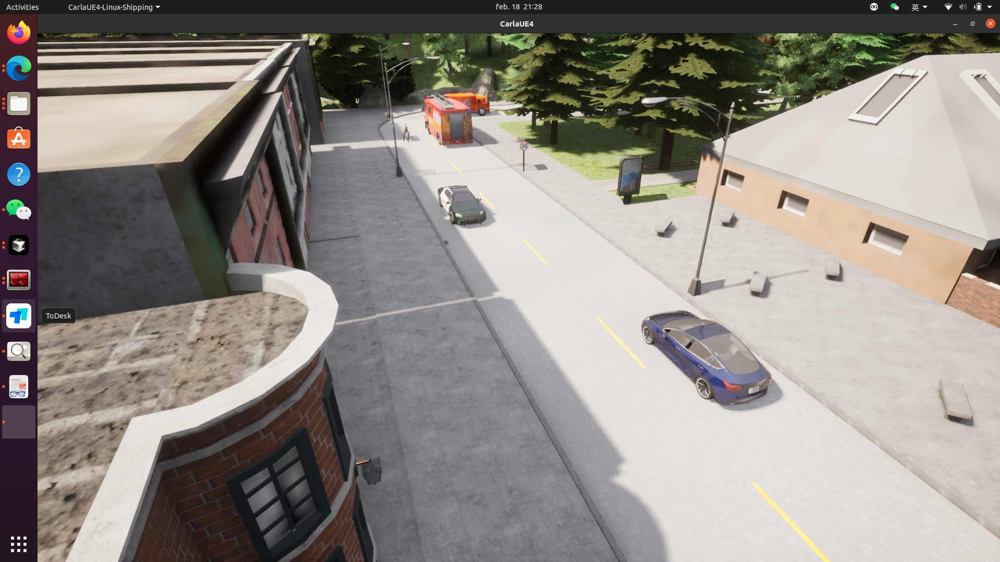
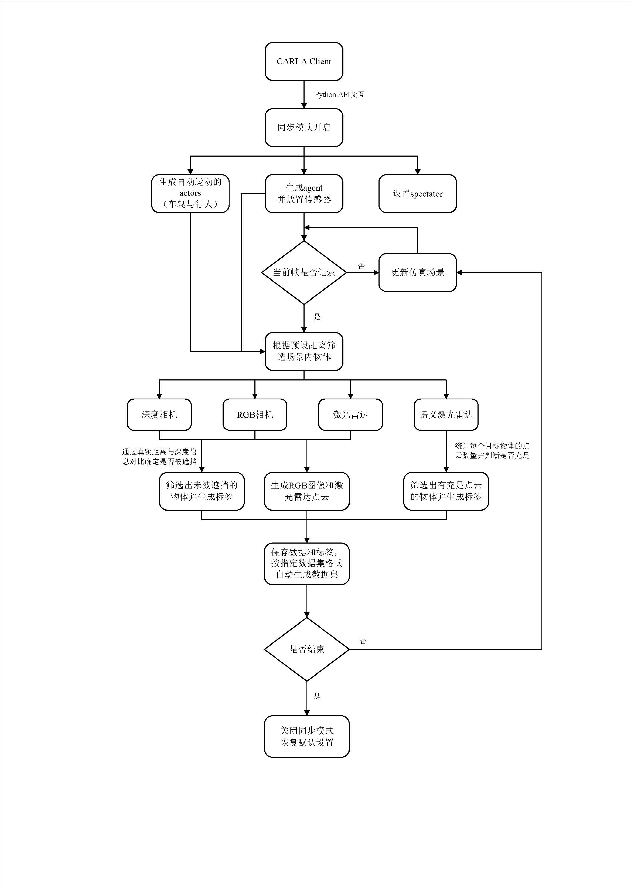
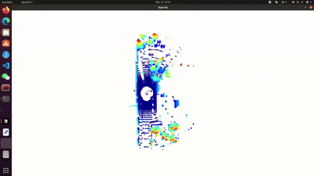

# CARLA-KITTI Roadside Dataset Auto-Generator


  

<p align="center">
  
  <p align="center">Figure 1. System Architecture Diagram</p>
</p>

## 📚 Table of Contents
1. [Project Background](#project-background)  
2. [Key Features](#key-features)
3. [Installation Guide](#installation-guide)
4. [Quick Start](#quick-start)
5. [Dataset Structure](#dataset-structure)
6. [Visualization Samples](#visualization-samples)
7. [Notes](#notes)
8. [Acknowledgements](#acknowledgements)

## 🌟 Project Background
This project is a high-quality roadside dataset auto-generator developed based on the CARLA simulation environment. It supports the following data outputs:
- **Multi-view RGB images** (resolution 1920×1080)
- **3D LiDAR point cloud data**
- **Annotation files** (including 2D/3D bounding boxes)
- **Sensor calibration parameters**

The generated data is fully compatible with the KITTI dataset format, making it suitable for training and validating autonomous driving perception algorithms.

## 🌟 Project Background
✅ **Multi-sensor synchronized data collection**  
　├─ Cameras (front/side/top multi-angles)  
　├─ LiDAR (32-beam)  
　└─ Inertial Measurement Unit  

✅ **Intelligent traffic flow generation**  
　├─ Random vehicle and pedestrian generation and control  
　├─ Dynamic weather system  
　└─ Support for complex road scenarios  

✅ **Automatic annotation system**  
　├─ Generates 2D/3D bounding box annotations  
　├─ Supports object category labeling (vehicles/pedestrians/traffic signs, etc.)  
　└─ Accurate position and orientation information  

## 🛠️ Installation Guide

### Environment Requirements
- **Python**: >= 3.6
- **CARLA Simulator**: >= 0.9.12

### Install Dependencies
1. Clone the repository:
   ```bash
   git clone https://github.com/Gary-Yifan-Zhang/Carla-Simulation-Dataset-Generator.git
   pip install -r requirements.txt

   # CARLA PythonAPI安装参考官方文档
   # https://carla.readthedocs.io/en/latest/build_system/
   ```
## 🚀 Quick Start


```python
# Step 1: Start CARLA server
./CarlaUE4.sh -quality-level=Epic

# tep 2: Run the generator script
python main.py 
```

## 📂 Dataset Structure
```bash
dataset/
├── image_2/            # Multi-view RGB images
├── velodyne/           # LiDAR point cloud data
├── label_2/            # 2D/3D annotation files
├── calib/              # Sensor calibration parameters
└── tracklets/          # Object motion trajectory data

```

## 🎨 Visualization Samples

### RGB Image with 3D Annotations
  
*RGB Image with 2D Bounding Boxes*

### LiDAR Point Cloud Visualization
  
*LiDAR Point Cloud Visualization*

## 📝 Notes
1. **The CARLA server must remain running** during data generation.
2. **A high-performance GPU is recommended** (e.g., 1080Ti or higher) for optimal performance.
3. **Data generation rate** is approximately **8-12 FPS**, depending on hardware configuration.
4. **Custom sensor layouts are supported**. Modify `config/sensors.json` to configure sensor placement.

## 🙏 Acknowledgements
This project is developed based on the following open-source projects:  
- [CARLA Simulator](https://carla.org/)  
- [mmmmaomao/DataGenerator](https://github.com/mmmmaomao/DataGenerator)  
- [KITTI Vision Benchmark Suite](https://www.cvlibs.net/datasets/kitti/)  

## 📅 TODO List
- [ ] Further modify data types
- [ ] Add bounding boxes to multi-view images
- [ ] Multi-radar fusion
- [ ] Create more complex scenarios using OpenScenario
- [ ] Migrate to CARLA with UE5


---

🔄 **Continuously updated** | 📧 **Issue reporting**: [Yifan Zhang](Gary.Yifan.Zhang@gmail.com)  
⭐️ **If this project is helpful to you, please give it a star on GitHub!**
