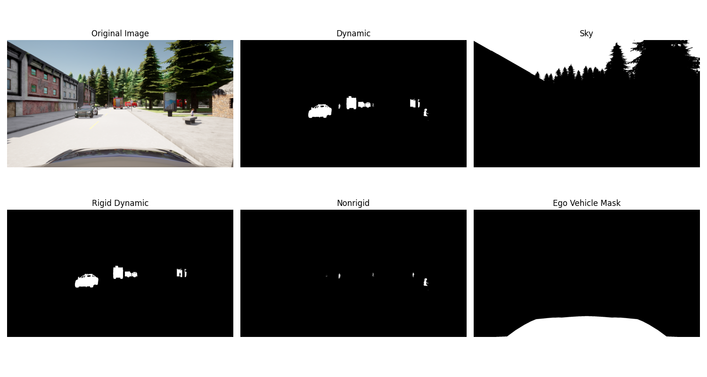

# CARLA-KITTI Roadside Dataset Auto-Generator


  

<p align="center">
  
  <p align="center">Figure 1. System Architecture Diagram</p>
</p>

## 📚 Table of Contents
1. [Project Background](#project-background)  
2. [Key Features](#key-features)
3. [Installation Guide](#installation-guide)
4. [Quick Start](#quick-start)
5. [Dataset Structure](#dataset-structure)
6. [Visualization Samples](#visualization-samples)
7. [Notes](#notes)
8. [Acknowledgements](#acknowledgements)

## 🌟 Project Background
This project is a high-quality roadside dataset auto-generator developed based on the CARLA simulation environment. It supports the following data outputs:
- **Multi-view RGB images** (resolution 1920×1080)
- **3D LiDAR point cloud data**
- **Annotation files** (including 2D/3D bounding boxes)
- **Sensor calibration parameters**

The generated data is fully compatible with the KITTI dataset format, making it suitable for training and validating autonomous driving perception algorithms.

## 🌟 Project Background
✅ **Multi-sensor synchronized data collection**  
　├─ Cameras (front/side/top multi-angles)  
　├─ LiDAR (32-beam)  
　└─ Inertial Measurement Unit  

✅ **Intelligent traffic flow generation**  
　├─ Random vehicle and pedestrian generation and control  
　├─ Dynamic weather system  
　└─ Support for complex road scenarios  

✅ **Automatic annotation system**  
　├─ Generates 2D/3D bounding box annotations  
　├─ Supports object category labeling (vehicles/pedestrians/traffic signs, etc.)  
　└─ Accurate position and orientation information  

## 🛠️ Installation Guide

### Environment Requirements
- **Python**: >= 3.6
- **CARLA Simulator**: >= 0.9.12

### Install Dependencies
1. Clone the repository:
   ```bash
   git clone https://github.com/Gary-Yifan-Zhang/Carla-Simulation-Dataset-Generator.git
   pip install -r requirements.txt

   # CARLA PythonAPI安装参考官方文档
   # https://carla.readthedocs.io/en/latest/build_system/
   ```
## 🚀 Quick Start


```python
# Step 1: Start CARLA server
./CarlaUE4.sh -quality-level=Epic

# tep 2: Run the generator script
python main.py 
```

## 📂 Dataset Structure
```bash
dataset/
├── bbox_img/          # RGB images with 2D bounding boxes
├── calib/             # Sensor calibration parameters
├── ego_state/         # Ego vehicle state information
├── image/             # Raw RGB images
├── image_label/       # Image annotation files
├── lidar_label/       # LiDAR annotation files
├── mask/              # Segmentation masks
│   ├── bbox/          # Bounding box masks
│   ├── ego/           # Ego vehicle masks
│   ├── nonrigid/      # Non-rigid object masks
│   ├── object_intersection/ # Object intersection masks
│   │   ├── nonrigid/  # Non-rigid object intersection masks
│   │   └── rigid/     # Rigid object intersection masks
│   ├── rigid/         # Rigid object masks
│   └── sky/           # Sky region masks
├── masked_images/     # Masked images
│   ├── nonrigid/      # Images with non-rigid object masks
│   ├── rigid/         # Images with rigid object masks
│   └── sky/           # Images with sky region masks
└── velodyne/          # LiDAR point cloud data
```


## 📝 Data Format Specification
```python
"""
# Values Name Description
# Values    Name      Description
----------------------------------------------------------------------------
   1    type         Object type: 'Car', 'Pedestrian', 'Vehicles', 'Vegetation', 'TrafficSigns', etc.
   1    id           Unique ID for the object, -1 if not specified
   1    truncated    Float from 0 (non-truncated) to 1 (truncated), where
                     truncated refers to the object leaving image boundaries
   1    occluded     Integer (0,1,2,3) indicating occlusion state:
                     0 = fully visible, 1 = partly occluded
                     2 = largely occluded, 3 = unknown
   1    alpha        Observation angle of object, ranging [-pi..pi]
   4    bbox         2D bounding box of object in the image (0-based index):
                     contains left, top, right, bottom pixel coordinates
   3    dimensions   3D object dimensions: height, width, length (in meters)
   3    location     3D object location x,y,z in camera coordinates (in meters)
   1    rotation_y   Rotation ry around Y-axis in camera coordinates [-pi..pi]
   1    score        Only for results: Float, indicating confidence in
                     detection, needed for p/r curves, higher is better.
"""
```

### 📷 Image Labels
- **Generation Method**: Generated by `is_visible_in_camera` function
- **Visibility Criteria**:
  - At least `MIN_VISIBLE_VERTICES_FOR_RENDER` vertices visible
  - At most `MAX_OUT_VERTICES_FOR_RENDER` vertices outside the image
- **Occlusion Determination**:
  - Fully visible: More than 6 vertices visible
  - Partially occluded: 4-5 vertices visible
  - Largely occluded: Less than 4 vertices visible
- **Truncation Calculation**: Number of vertices outside image / 8
- **Label Fields** (in KITTI standard format order):
  - `type`: Object type (e.g., 'Car', 'Pedestrian', etc.)
  - `id`: Unique object ID, -1 if not specified
  - `truncated`: Float from 0 (non-truncated) to 1 (truncated), indicating the extent the object leaves image boundaries
  - `occlusion`: Integer (0,1,2):
     - 0 = fully visible
     - 1 = partly occluded
     - 2 = largely occluded
  - `alpha`: Observation angle, fixed at 0 (no angle information in camera data)
  - `bbox`: 2D bounding box in image (0-based index): [left, top, right, bottom] pixel coordinates
  - `dimensions`: 3D object dimensions (height, width, length)
  - `location`: 3D object location (x, y, z) in camera coordinates
  - `rotation_y`: Rotation around Y-axis in camera coordinates


### 🛰️ LiDAR Labels
- **Generation Method**: Generated by `is_visible_in_lidar` function
- **Visibility Criteria**: At least `MIN_VISIBLE_NUM_FOR_POINT_CLOUDS` point clouds belong to the target object
- **Fixed Values**:
  - `truncated`: 0 (LiDAR is not limited by image boundaries)
  - `occlusion`: 0 (LiDAR directly detects object surfaces)
  - `alpha`: 0 (LiDAR has no observation angle information)
  - `bbox`: [0, 0, 0, 0] (LiDAR has no 2D bounding box information)
  - **Label Fields** (in KITTI standard format order):
  - `type`: Object type (e.g., 'Car', 'Pedestrian', etc.)
  - `id`: Unique object ID, -1 if not specified
  - `truncated`: Float from 0 (non-truncated) to 1 (truncated), indicating the extent the object leaves image boundaries
  - `occlusion`: Integer (0,1,2):
     - 0 = fully visible
     - 1 = partly occluded
     - 2 = largely occluded
  - `alpha`: Observation angle, fixed at 0 (no angle information in camera data)
  - `dimensions`: 3D object dimensions (height, width, length)
  - `location`: 3D object location (x, y, z) in camera coordinates
  - `rotation_y`: Rotation around Y-axis in camera coordinates

## 📡 Sensor Configuration

### 🚗 Main Sensors
- **RGB Camera**:
  - Resolution: 1920x1080
  - FOV: 90°
  - Position: Front center (0, 0.0, 1.6)
  
- **Depth Camera**:
  - Resolution: 1920x1080
  - FOV: 90°
  - Position: Front center (0, 0, 1.6)

- **LiDAR**:
  - Range: 70m
  - Rotation Frequency: 20Hz
  - Vertical FOV: -10° to +20°
  - Points per Second: 2.56M
  - Channels: 128
  - Position: Front center (0, 0, 1.6)

- **Semantic LiDAR**:
  - Same specifications as LiDAR
  - Additional semantic information

### 🎥 Auxiliary Cameras
- **Sub RGB Cameras** (2 units):
  - Resolution: 1920x1080
  - FOV: 90°
  - Positions: 
    - Left: (0, 0.1, 1.6)
    - Right: (0, -0.1, 1.6)

- **View RGB Camera**:
  - Resolution: 1920x1080
  - FOV: 90°
  - Position: (1.0, -3.2, 1.6)
  - Rotation: 30° yaw

- **BEV Camera**:
  - Resolution: 720x360
  - FOV: 90°
  - Position: (0.0, 0.0, 40.0)
  - Rotation: -90° pitch (top-down view)

### 🛰️ Auxiliary LiDARs (4 units):
  - Range: 70m
  - Rotation Frequency: 20Hz
  - Vertical FOV: -10° to +20°
  - Points per Second: 640K
  - Channels: 128
  - Positions:
    - Front Left: (0, -0.8, 1.6)
    - Front Right: (0, 0.8, 1.6)
    - Rear Left: (-1, -0.8, 1.6)
    - Rear Right: (-1, 0.8, 1.6)

### 🎨 Semantic Camera:
  - Resolution: 1920x1080
  - FOV: 90°
  - Position: Front center (0, 0.0, 1.6)
  
## 🎨 Visualization Samples

### RGB Image with 3D Annotations
  
*RGB Image with 2D Bounding Boxes*

### LiDAR Point Cloud Visualization
  
*LiDAR Point Cloud Visualization*

### Segmentation Masks
  
*Visualization of different types of segmentation masks including rigid, non-rigid, and sky masks*


## 📝 Notes
1. **The CARLA server must remain running** during data generation.
2. **A high-performance GPU is recommended** (e.g., 1080Ti or higher) for optimal performance.
3. **Data generation rate** is approximately **8-12 FPS**, depending on hardware configuration.
4. **Custom sensor layouts are supported**. Modify `config/sensors.json` to configure sensor placement.

## 🙏 Acknowledgements
This project is developed based on the following open-source projects:  
- [CARLA Simulator](https://carla.org/)  
- [mmmmaomao/DataGenerator](https://github.com/mmmmaomao/DataGenerator)  
- [KITTI Vision Benchmark Suite](https://www.cvlibs.net/datasets/kitti/)  

## 📅 TODO List
- [ ] Further modify data types
- [ ] Add bounding boxes to multi-view images
- [ ] Multi-radar fusion
- [ ] Create more complex scenarios using OpenScenario
- [ ] Migrate to CARLA with UE5
- [ ] Bugs in 3D bounding boxes of traffic lights


---

🔄 **Continuously updated** | 📧 **Issue reporting**: [Yifan Zhang](Gary.Yifan.Zhang@gmail.com)  
⭐️ **If this project is helpful to you, please give it a star on GitHub!**
